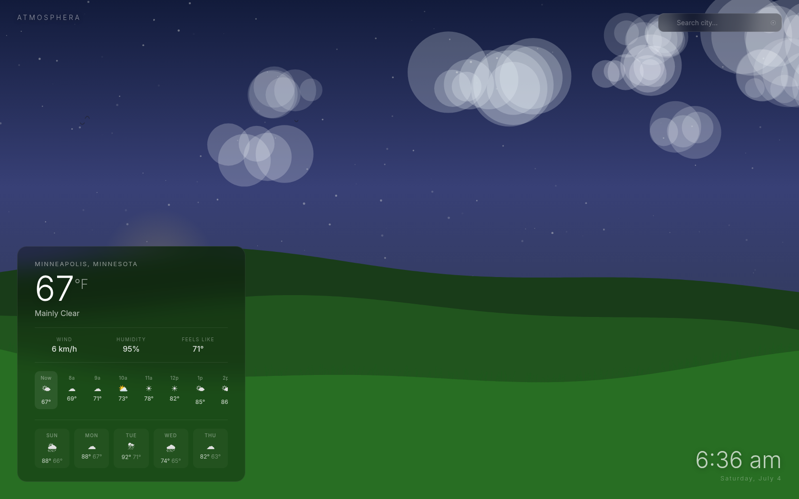

# Atmosphera

A weather dashboard that renders the current conditions as an animated canvas scene. The sky, terrain, clouds, rain, snow, fog, and lightning are all drawn procedurally and driven by live data from the Open-Meteo API. Vanilla JavaScript, no framework, no dependencies, no build step.

## Features

- Animated scene that reacts to real weather: sky color shifts with time of day (sunrise/sunset from the forecast), cloud density scales with cloud cover, precipitation intensity maps from WMO weather codes
- Current conditions panel with temperature, wind, humidity, and feels-like
- 24-hour hourly strip and 5-day forecast
- City search (Open-Meteo geocoding) and browser geolocation
- Celsius/Fahrenheit toggle

## Running

```
docker compose up -d
```

Serves on port 8090 via nginx. A health endpoint is available at `/health`.

There is no build step. The `src/` directory is copied into the nginx image as-is, so any static file server pointed at `src/` works for local development.

## Screenshots


